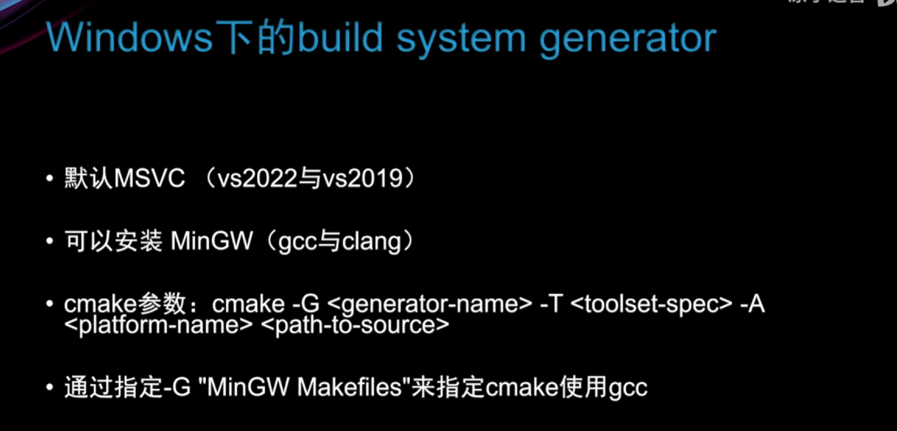

# CMake初体验

1. CMake构建流程(Windows下)

   * 构建项目，并编写CMakeLists.txt文件（一般内容如下)

   ```c++
   cmake_minimum_required(VERSION 3.25)
   project(Hello)
   add_executable(Hello hello.cpp)
   ```

   * cmake -B build
   * cmake --build build
   * 执行生成的exe文件
2. Window下使用CMake构建项目

   
3. Linux下使用CMake构建项目

---

# CMake语法

1. 概述以及如何打印
2. 变量操作set、list
3. 流程控制
4. 函数
5. 作用域
6. 宏

---

# CMake构建项目的四种方式

1. 直接写入源码路径的方式
2. 调用cmake脚本的方式
3. CMakeLists嵌套
4. Object Libraries

---

# CMake与静态库和动态库

1. 如何生成静态库和动态库
2. CMake如何调用静态库与动态库

---

# CMake与源文件交互

1. 实例展示

---

# CMake条件编译

1. 实例展示
