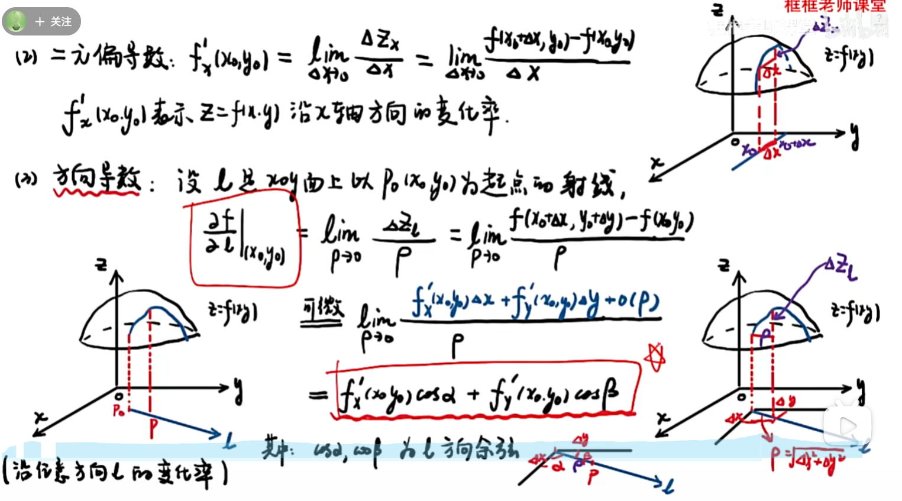

$\nabla$算子

$\nabla\psi = (\frac{\nabla}{\nabla x}, \frac{\nabla}{\nabla y}, \frac{\nabla}{\nabla z})$

# 1、方向导数

[此视频解释了方向导数为什么是偏导数乘方向余弦](https://www.bilibili.com/video/BV1tr421377j/?spm_id_from=333.337.search-card.all.click&vd_source=542ff23b511c29e461d0f79fd2832429)

# 2、梯度(gradient)

梯度是一个向量，其方向是变化最快的方向

# 3、散度(divergence)

# 4、旋度(curl)
