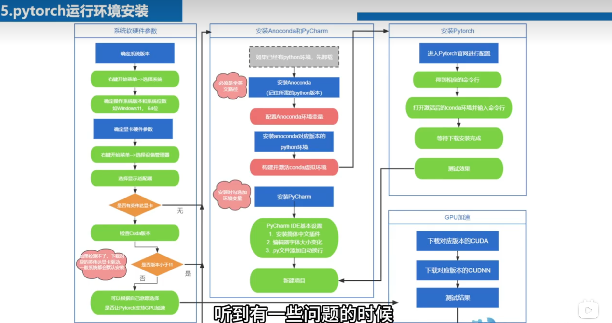
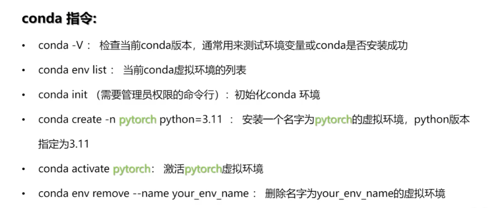

# Pytorch学习

昨天感觉什么都没干，笔记也摆烂了一天~~~

## AI算力三要素

### 数据

### 算法

### 算力

## pytorch运行环境安装

### 安装步骤

### conda指令

# 深度学习概念及pytorch实战

### 标量、向量、矩阵、张量

前三个概念是张量的特例

张量表示：$R^{2*3*2}$表示两个3*2的矩阵拼接起来，其他四维、五维类似
