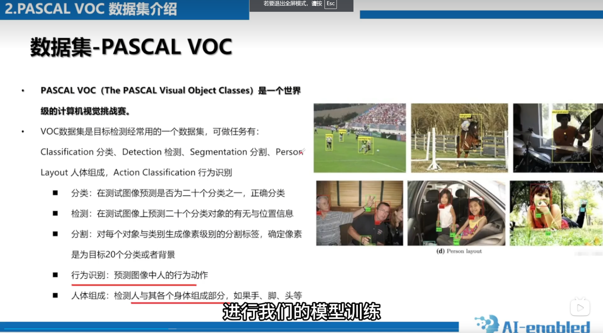
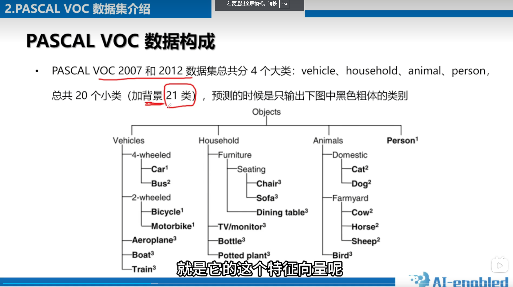

# 目标检测问题基础概念

* 图像识别 Image Classification
* 目标检测 Object Detection
* 语义分割 Semantic segmentation
* 实例分割 Instance segmentation

# 深度学习经典目标检测算法

* Two-Stage
  例如Faster-Rcnn，Mask-Rcnn系列，通过专门模块去生成候选框(RPN)寻找前景以及调整边界框，基于之前生成的候选框进行进一步分类及调整边界框
* One-Stage
  l例如Yolo系列，SSD算法，采用一个网络一步到位，直接进行分类及调整边界框

# 数据集介绍(PASCAL VOC)

PASCAL VOC(the pascal visual object classes)是一个世界级的计算机视觉挑战赛.

# MS COCO数据集介绍
