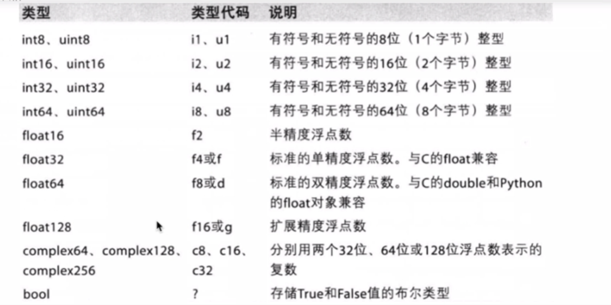

# Python数据分析快速入门numpy,pandas,matplotlib

## Numpy中的多维数组

```python
arr = np.array([1, 2, 3, 4, 5]) #定义
np.ndim(arr) #多维数组的维度
np.shape(arr) #多维数组的形状
brr = np.zeros(5) #填充
brr = np.zeros((5, 5))
crr = np.ones(5)
drr = np.arange(1, 100, 2)
```

## Numpy中的数据类型



```python
arr = np.array([1, 2, 3], dtype=float)
```

## 多维数组的运算

在NumPy中，多维数组的运算是其核心功能之一。NumPy数组（通常称为 `ndarray`）支持元素级的运算，这意味着你可以对数组中的每个元素执行相同的操作，而无需编写循环。这些运算包括基本的算术运算、比较运算、逻辑运算等。

### 基本算术运算

NumPy数组支持所有的基本算术运算，包括加法、减法、乘法和除法。这些运算可以逐元素进行。

```python
import numpy as np

# 创建两个数组
a = np.array([1, 2, 3])
b = np.array([4, 5, 6])

# 加法
c = a + b  # 结果: [5, 7, 9]

# 减法
d = a - b  # 结果: [-3, -3, -3]

# 乘法
e = a * b  # 结果: [4, 10, 18]

# 除法
f = a / b  # 结果: [0.25, 0.4, 0.5]
```

### 比较运算

NumPy数组也支持比较运算，如等于、不等于、大于、小于等。

```python
# 比较运算
g = a == b  # 结果: [False, False, False]
h = a != b  # 结果: [True, True, True]

# 大于
i = a > b  # 结果: [False, False, False]

# 小于
j = a < b  # 结果: [True, True, True]
```

### 逻辑运算

NumPy数组支持逻辑运算，如与、或、非。

```python
# 逻辑运算
k = a & b  # 结果: [0, 0, 0] (按位与)
l = a | b  # 结果: [1, 1, 1] (按位或)
m = ~a     # 结果: [-2, -3, -4] (按位非)
```

### 广播机制

NumPy的一个强大特性是广播（broadcasting），它允许不同形状的数组进行算术运算。广播规则允许较小的数组“广播”到较大数组的形状，以便进行逐元素运算。

```python
# 创建两个形状不同的数组
a = np.array([1, 2, 3])
b = np.array([[1], [2], [3]])

# 加法，b被广播到a的形状
c = a + b  # 结果: [[2, 3, 4], [3, 4, 5], [4, 5, 6]]
```

### 数学函数

NumPy提供了大量的数学函数，可以对数组进行元素级的操作，如三角函数、指数、对数等。

```python
# 三角函数
n = np.sin(np.pi / 2)  # 结果: 1.0

# 指数
o = np.exp(1)  # 结果: 2.718281828459045

# 对数
p = np.log(np.e)  # 结果: 1.0
```

### 线性代数运算

NumPy还提供了线性代数运算，如矩阵乘法、矩阵分解、行列式等。

```python
# 创建两个二维数组
A = np.array([[1, 2], [3, 4]])
B = np.array([[5, 6], [7, 8]])

# 矩阵乘法
C = np.dot(A, B)  # 结果: [[19, 22], [43, 50]]

# 矩阵转置
D = A.T  # 结果: [[1, 3], [2, 4]]
```

## 多维数组的索引和切片

在NumPy中，多维数组的索引和切片操作非常灵活且强大，允许你访问和修改数组的特定部分。这些操作对于数据分析和科学计算非常重要。

### 基本索引

你可以使用基本索引来访问数组的单个元素或子数组。

```python
import numpy as np

# 创建一个二维数组
arr = np.array([[1, 2, 3], [4, 5, 6], [7, 8, 9]])

# 访问单个元素
print(arr[0, 0])  # 输出: 1

# 访问子数组（一行）
print(arr[0])     # 输出: [1 2 3]

# 访问子数组（一列）
print(arr[:, 0])  # 输出: [1 4 7]
```

### 切片

切片操作允许你访问数组的一个范围。切片使用冒号 `:` 分隔的开始和结束索引。

```python
# 切片访问
print(arr[0:2, 1:3])  # 输出: [[2 3]
                      #        [5 6]]
```

### 花式索引（Fancy indexing）

花式索引允许你使用整数数组或布尔数组来选择数组的特定元素。

```python
# 使用整数数组进行花式索引
indices = np.array([0, 2])
print(arr[indices, :])  # 输出: [[1 2 3]
                         #        [7 8 9]]

# 使用布尔数组进行花式索引
mask = np.array([True, False, True])
print(arr[mask, :])  # 输出: [[1 2 3]
                     #        [7 8 9]]
```

### 布尔索引

布尔索引允许你使用布尔表达式来选择数组的元素。

```python
# 使用布尔索引
print(arr[arr > 5])  # 输出: [6 7 8 9]
```

### 高级索引

高级索引允许你使用整数数组来选择数组的特定元素，并且可以指定步长。

```python
# 使用高级索引
print(arr[[0, 2], [0, 2]])  # 输出: [1 9]
```

### 使用切片和索引的组合

你可以将切片和索引组合使用，以访问数组的复杂部分。

```python
# 组合使用切片和索引
print(arr[0:2, 1:3])  # 输出: [[2 3]
                      #        [5 6]]
```

### 修改数组的部分元素

你可以使用索引和切片来修改数组的部分元素。

```python
# 修改数组的部分元素
arr[0, 0] = 10
print(arr)  # 输出: [[10  2  3]
            #        [ 4  5  6]
            #        [ 7  8  9]]

# 使用切片修改数组的部分元素
arr[0:2, 0:2] = [[20, 30], [40, 50]]
print(arr)  # 输出: [[20 30  3]
            #        [40 50  6]
            #        [ 7  8  9]]
```

## 相关统计函数

NumPy 提供了大量的统计函数，用于对数组进行统计分析。这些函数可以帮助你计算平均值、中位数、标准差、方差等统计指标。

以下是一些常用的 NumPy 统计函数：

### 1. 平均值

- `np.mean(a, axis=None, dtype=None, out=None, keepdims=<no value>)`: 计算沿指定轴的算术平均值。

  ```python
  import numpy as np

  arr = np.array([[1, 2], [3, 4]])
  print(np.mean(arr))  # 输出: 2.5
  ```

### 2. 中位数

- `np.median(a, axis=None, out=None, overwrite_input=False)`: 计算沿指定轴的中位数。

  ```python
  print(np.median(arr))  # 输出: 2.5
  ```

### 3. 众数

- `np.bincount(x, weights=None, minlength=0)`: 返回数组中每个值的出现次数。

  ```python
  arr = np.array([0, 1, 1, 3, 2, 1, 7])
  print(np.bincount(arr))  # 输出: [0 1 2 3 4 5 6 7]
  ```

### 4. 标准差

- `np.std(a, axis=None, dtype=None, out=None, ddof=0, keepdims=<no value>)`: 计算沿指定轴的标准差。

  ```python
  print(np.std(arr))  # 输出: 1.118033988749895
  ```

### 5. 方差

- `np.var(a, axis=None, dtype=None, out=None, ddof=0, keepdims=<no value>)`: 计算沿指定轴的方差。

  ```python
  print(np.var(arr))  # 输出: 1.25
  ```

### 6. 最大值和最小值

- `np.max(a, axis=None, out=None, keepdims=<no value>, initial=<no value>, where=<no value>)`: 计算沿指定轴的最大值。
- `np.min(a, axis=None, out=None, keepdims=<no value>, initial=<no value>, where=<no value>)`: 计算沿指定轴的最小值。

  ```python
  print(np.max(arr))  # 输出: 4
  print(np.min(arr))  # 输出: 1
  ```

### 7. 百分位数

- `np.percentile(a, q, axis=None, out=None, overwrite_input=False, interpolation='linear', keepdims=False)`: 计算沿指定轴的百分位数。

  ```python
  print(np.percentile(arr, 50))  # 输出: 2.5
  ```

### 8. 求和

- `np.sum(a, axis=None, dtype=None, out=None, keepdims=<no value>, initial=0, where=<no value>)`: 计算沿指定轴的和。

  ```python
  print(np.sum(arr))  # 输出: 10
  ```

### 9. 累积和

- `np.cumsum(a, axis=None, dtype=None, out=None)`: 计算沿指定轴的累积和。

  ```python
  print(np.cumsum(arr))  # 输出: [ 1  3  6 10]
  ```

### 10. 累积积

- `np.cumprod(a, axis=None, dtype=None, out=None)`: 计算沿指定轴的累积积。

  ```python
  arr = np.array([1, 2, 3, 4])
  print(np.cumprod(arr))  # 输出: [ 1  2  6 24]
  ```

## random类

`np.random` 是 NumPy 库中用于生成随机数的一个模块。它提供了多种函数来生成不同分布的随机数，包括均匀分布、正态分布、指数分布等。以下是一些常用的 `np.random` 函数：

1. `np.random.rand(d0, d1, ..., dn)`：生成一个形状为 (d0, d1, ..., dn) 的数组，数组中的元素从区间 [0, 1) 均匀分布。
2. `np.random.randn(d0, d1, ..., dn)`：生成一个形状为 (d0, d1, ..., dn) 的数组，数组中的元素来自标准正态分布。
3. `np.random.randint(low, high=None, size=None, dtype='l')`：生成一个或多个随机整数，范围从 low（包含）到 high（不包含）。
4. `np.random.random_sample(d0, d1, ..., dn)`：与 `np.random.rand` 相同，生成一个形状为 (d0, d1, ..., dn) 的数组，数组中的元素从区间 [0, 1) 均匀分布。
5. `np.random.normal(loc=0.0, scale=1.0, size=None)`：生成一个或多个服从正态分布的随机数，均值为 loc，标准差为 scale。
6. `np.random.choice(a, size=None, replace=True, p=None)`：从给定的一维数组 a 中随机选择元素。
7. `np.random.shuffle(x)`：用于原地打乱一维数组 x。
8. `np.random.permutation(x)`：返回一个随机排列的数组 x。
9. `np.random.seed(seed=None)`：设置随机数生成器的种子，确保随机数的可重复性。

# Pandas介绍

## Series的使用

在Python中，`Series` 是 `pandas` 库中的一个基本数据结构，用于处理一维标签化数组。`Series` 可以存储任何数据类型（整数、字符串、浮点数、Python 对象等），并且每个 `Series` 对象都有一个与之对应的索引（Index）。

### 创建Series

创建 `Series` 对象的最简单方式是传递一个列表：

```python
import pandas as pd

# 创建一个Series
s = pd.Series([1, 3, 5, np.nan, 6, 8])

print(s)
```

默认情况下，`Series` 的索引是从 0 开始的整数序列。你也可以指定索引：

```python
# 指定索引
s = pd.Series([1, 3, 5, np.nan, 6, 8], index=['a', 'b', 'c', 'd', 'e', 'f'])

print(s)
```

### 访问数据

你可以通过索引标签访问 `Series` 中的数据：

```python
print(s['a'])  # 输出: 1.0
```

你也可以使用切片来选择一部分数据：

```python
print(s['a':'c'])  # 输出: a    1.0
                   #         b    3.0
                   #         c    5.0
```

### 属性

`Series` 对象有一些有用的属性：

- `index`：返回索引标签的数组。
- `values`：返回 `Series` 中数据的数组。
- `size`：返回 `Series` 中元素的数量。
- `dtype`：返回 `Series` 中数据的类型。

```python
print(s.index)  # 输出: Index(['a', 'b', 'c', 'd', 'e', 'f'], dtype='object')
print(s.values)  # 输出: [ 1.  3.  5. nan  6.  8.]
print(s.size)    # 输出: 6
print(s.dtype)   # 输出: float64
```

### 方法

`Series` 提供了许多用于数据操作的方法：

- `head(n)`：返回前 `n` 个元素。
- `tail(n)`：返回后 `n` 个元素。
- `describe()`：返回描述性统计信息。
- `mean()`：计算平均值。
- `sum()`：计算总和。
- `std()`：计算标准差。
- `var()`：计算方差。
- `unique()`：返回唯一值。
- `value_counts()`：返回每个值出现的次数。

```python
# 使用方法
print(s.head(3))  # 输出: a    1.0
                   #         b    3.0
                   #         c    5.0

print(s.describe())  # 提供描述性统计信息

print(s.mean())  # 输出: 4.0
print(s.sum())   # 输出: 24.0
print(s.std())   # 输出: 2.160246899469287
print(s.var())   # 输出: 4.666666666666667
print(s.unique())  # 输出: array([ 1.,  3.,  5.,  6.,  8.])
print(s.value_counts())  # 输出: 5    1.0
                         #         3    1.0
                         #         6    1.0
                         #         1    1.0
                         #         4    NaN
                         #         2    NaN
```

### 布尔索引

你可以使用布尔索引来过滤 `Series` 中的数据：

```python
print(s[s > 4])  # 输出: e    6.0
                 #         f    8.0
```

### 缺失数据

`Series` 处理缺失数据的方式与 `NumPy` 类似：

```python
# 创建包含缺失值的Series
s_missing = pd.Series([1, np.nan, 3, 4, np.nan], index=['a', 'b', 'c', 'd', 'e'])

print(s_missing.dropna())  # 删除缺失值

print(s_missing.fillna(0))  # 用0填充缺失值

print(s_missing.isna())  # 检查缺失值
```

## DataFrame的基本概念

`DataFrame` 是 `pandas` 库中的一个核心数据结构，用于处理表格数据。`DataFrame` 是一个二维标签化数据结构，你可以将其想象成一个Excel电子表格或者SQL表，其中有行和列。每一列可以是不同的数据类型（数值、字符串、布尔值等），这使得 `DataFrame` 非常适合处理现实世界中的数据。

### 创建DataFrame

创建 `DataFrame` 的最简单方式是使用字典，其中键是列名，值是数据列。

```python
import pandas as pd

# 创建一个DataFrame
df = pd.DataFrame({
    'column1': [1, 2, 3, 4],
    'column2': ['a', 'b', 'c', 'd'],
    'column3': [1.1, 2.2, 3.3, 4.4]
})

print(df)
```

你也可以使用列表的列表（或者 `ndarray`），在这种情况下，你需要为每列指定列名。

```python
# 使用列表的列表创建DataFrame
df = pd.DataFrame([
    [1, 'a', 1.1],
    [2, 'b', 2.2],
    [3, 'c', 3.3],
    [4, 'd', 4.4]
], columns=['column1', 'column2', 'column3'])

print(df)
```

### 访问数据

你可以通过列名访问 `DataFrame` 中的数据：

```python
print(df['column1'])  # 输出: 0    1
                      #         1    2
                      #         2    3
                      #         3    4
                      #         Name: column1, dtype: int64
```

你也可以通过 `.loc` 和 `.iloc` 属性来访问数据：

- `.loc` 基于标签的索引。
- `.iloc` 基于整数位置的索引。

```python
# 使用.loc访问
print(df.loc[0, 'column1'])  # 输出: 1

# 使用.iloc访问
print(df.iloc[0, 0])  # 输出: 1
```

### 修改数据

你可以修改 `DataFrame` 中的数据：

```python
# 修改单个值
df.at[0, 'column1'] = 10
print(df)

# 修改整列
df['column1'] = [10, 20, 30, 40]
print(df)
```

### 添加和删除列

你可以轻松地向 `DataFrame` 中添加新列或删除现有列：

```python
# 添加新列
df['column4'] = [True, False, True, False]

# 删除列
df.drop('column3', axis=1, inplace=True)  # 删除column3列
```

### 描述性统计

`DataFrame` 提供了许多方法来计算描述性统计信息：

```python
# 计算平均值
print(df.mean())

# 计算标准差
print(df.std())

# 计算最大值
print(df.max())

# 计算最小值
print(df.min())

# 计算总和
print(df.sum())
```

### 缺失数据处理

`DataFrame` 提供了处理缺失数据的工具：

```python
# 创建包含缺失值的DataFrame
df_missing = pd.DataFrame({
    'column1': [1, 2, None, 4],
    'column2': ['a', None, 'c', 'd'],
    'column3': [1.1, 2.2, None, 4.4]
})

# 删除包含缺失值的行
df_dropped = df_missing.dropna()

# 填充缺失值
df_filled = df_missing.fillna(value=0)
```

### 数据过滤

你可以使用布尔索引来过滤 `DataFrame` 中的数据：

```python
# 过滤column1大于2的行
filtered_df = df[df['column1'] > 2]
```

### 数据排序

你可以使用 `sort_values` 方法对 `DataFrame` 中的数据进行排序：

```python
# 按column1列的值进行排序
sorted_df = df.sort_values(by='column1')
```

# matplotlib的简单使用
