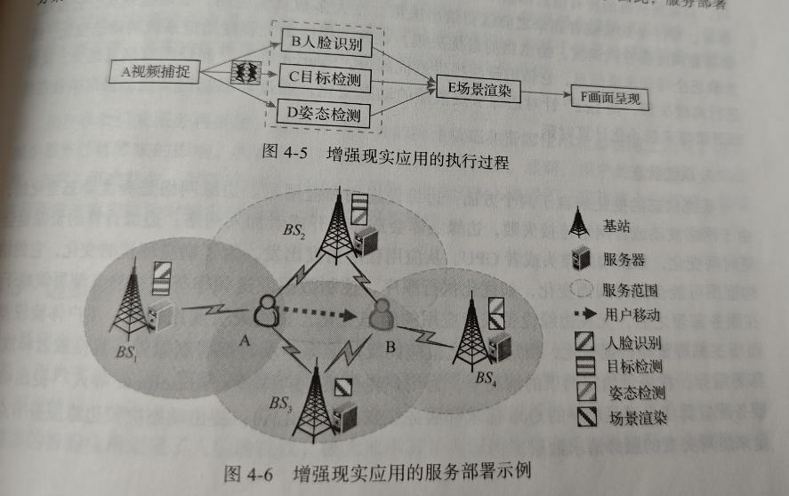

# 边缘计算核心技术

## 异构计算技术

异构计算技术是指使用不同类型的指令集和体系架构的计算单元组成的系统的计算方式。

如CPU、GPU、FPGA(现场可编程门阵列)

## 虚拟化技术

由于用户提出的任务请求存在高度的异构性，这就要求边缘服务器能够灵活运行各种计算服务。包括硬件抽象级的虚拟化、指令集架构级虚拟化、操作系统级虚拟化、编程语言级虚拟化、库函数级虚拟化。从而实现计算资源和计算服务的灵活管理。

## 软件定义网络技术

SDN是对传统网络架构的一次重构，由传统的分布式控制网络架构转变为集中式控制网络架构。包括应用层、控制层、基础设施层。与传统的网络设备对流量的控制和转发独立控制不同，SDN的核心在于将路由器和交换机中的控制功能从网络设备中分离出来啊，网络设备采用通用的控制平台，只负责数据转发，而原来用于网络逻辑控制的功能采用相对独立的、集中的控制器替代。

## 无线传输技术(暂时没做过多的深入了解)

## 微服务架构技术

微服务是一种软件架构风格，将复杂的应用程序拆分成一系列专注于单一责任与功能的服务，各服务之间使用对外开放不受语言限制的API进行交互。如Spring Cloud、Dubbo等。

# 主要研究方向与挑战

## 计算卸载

用户驱动型应用，如云游戏、增强现实、虚拟现实等，往往需要强大的算力来支持其密集计算。移动端的计算能力有限，需要将计算任务下沉到边缘节点，使用用户能够将计算卸载至最近的节点进行处理，从而提升效能。

## 服务部署

我们通过一个例子来深入理解服务部署问题，如图所示，为增强现实应用的执行过程，其中视频捕捉和画面呈现等简单操作在本机处理器上即可实现，然而人脸识别、目标检测、姿态检测和场景渲染等操作需要强大算力的支持，因而需要将其服务器卸载至就近的边缘服务器进行处理。

## 边缘智能

总的来说，人工智能为边缘计算提供技术和方法，如基于神经网络的强化学习、联邦学习、模仿学习深度超分辨率等，而边缘计算也为人工智能提供了场景和平台，如视频分析、视频增强、虚拟现实、自动驾驶、资源调度等。

# 面向边缘计算的视频分析
