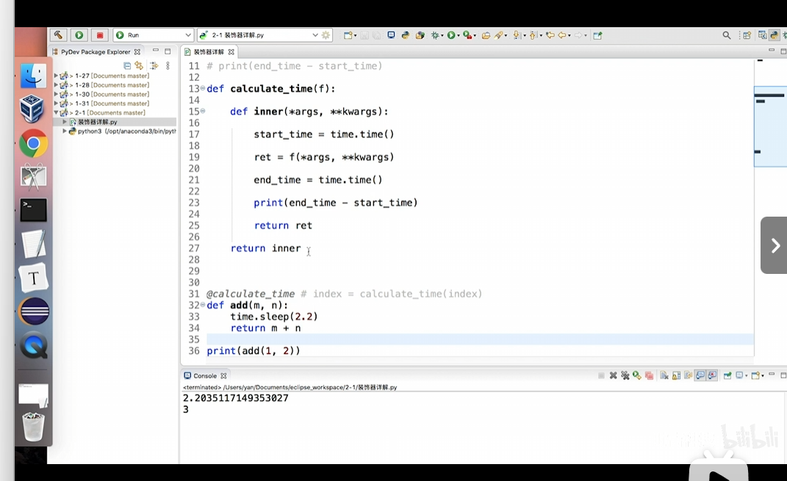

# Python生成器

```python-repl
def f():
    a = yield 1
    print(f"a={a}")
    b = yield "hello"
    print(f"b={b}")

# 创建生成器对象
ret = f()
# 启动生成器，执行到第一个yield
print(next(ret))
# 向生成器发送值，并继续执行到下一个yield
print(ret.send("he"))  # 修改为 ret.send("he")

```

# Python装饰器

```python
def calculate(f):
    def inner(*args, **kwargs):
        start_time = time.time()
        ret = f(*args, **kwargs)
        end_time = time.time()
        print(end_time-start_time)
        return ret
    return inner

@calculate
def cnt(x:int):
    sum = 0
    for i in range(x):
        sum += i
    return sum
print(cnt(1000000000))
```

Python的位置参数和关键字参数

在Python中，函数参数可以分为两种类型：位置参数和关键字参数。

### 位置参数（Positional Arguments）

位置参数是指在调用函数时，参数的传递顺序必须与函数定义时参数的顺序相匹配。这些参数在函数定义中不包含任何特殊标识符。例如，在函数 `add(a, b)`中，`a`和 `b`都是位置参数。调用这个函数时，必须按照定义的顺序传递参数值，如 `add(1, 2)`。

### 关键字参数（Keyword Arguments）

关键字参数提供了一种更灵活的函数调用方式，允许函数调用时指定参数名称，而不必依赖于参数的位置。这在函数具有多个参数时特别有用，因为它可以提高代码的可读性。关键字参数在函数调用时使用参数名称来指定参数值，如 `add(a=1, b=2)`。

### 示例

让我们通过一个具体的例子来说明这两种参数的使用：

```python
def greet(first_name, last_name, greeting="Hello"):
    print(f"{greeting}, {first_name} {last_name}!")

# 使用位置参数调用函数
greet("John", "Doe")  # 输出: Hello, John Doe!

# 使用关键字参数调用函数，提高可读性
greet(first_name="John", last_name="Doe")  # 输出: Hello, John Doe!

# 使用关键字参数指定默认参数
greet(first_name="Jane", greeting="Hi")  # 输出: Hi, Jane Doe!
```

在这个例子中，`first_name`和 `last_name`是位置参数，而 `greeting`是一个关键字参数，它有一个默认值 `"Hello"`。当我们调用 `greet`函数时，可以使用位置参数按顺序传递值，也可以使用关键字参数通过参数名称指定值。关键字参数允许我们在调用函数时跳过一些参数（如果有默认值的话），并且可以不按顺序传递参数值，只要我们使用了参数名称。

# 函数闭包

```python-repl
def make_adder():
    z = 0
    def inner(y):
        nonlocal z
        z += y
        return z
    return inner  # 返回内部函数

add_5 = make_adder()
print(add_5(10))       # 输出:10
print(add_5(10))       # 输出:20
```

# Python引用类型变量

在 Python 中，引用类型变量意味着变量保存的是数据的引用（即指向该数据的内存地址），而不是数据的实际值。这种引用行为适用于所有可变类型，如列表、字典、集合等。理解引用类型变量的关键在于：对于这些类型的对象，直接赋值不会创建新对象，而是共享相同的内存地址。这会影响变量之间的关系，特别是在赋值和修改时。

### 常见的引用类型

1. **列表（List）** ：如 `a = [1, 2, 3]`，如果 `b = a`，则 `b` 和 `a` 指向同一内存地址，修改其中一个变量会影响另一个。
2. **字典（Dictionary）** ：如 `a = {'key': 'value'}`，`b = a` 会导致 `b` 和 `a` 指向同一对象。
3. **集合（Set）** ：同样的引用行为，赋值后共享相同内存地址
